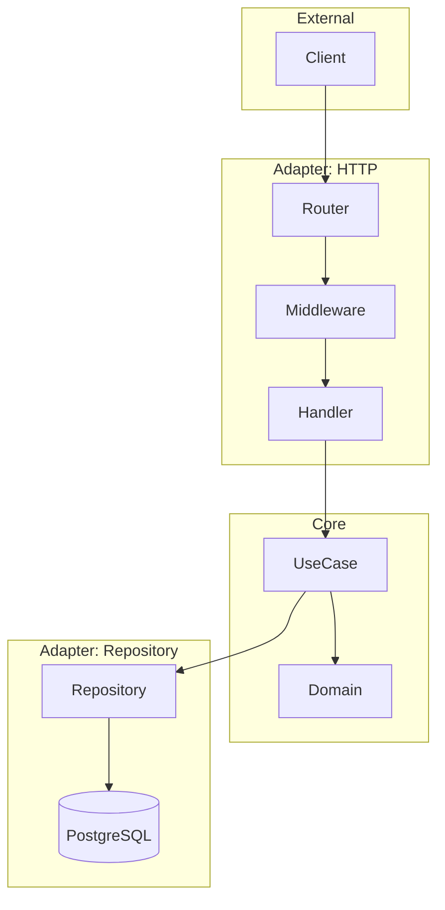
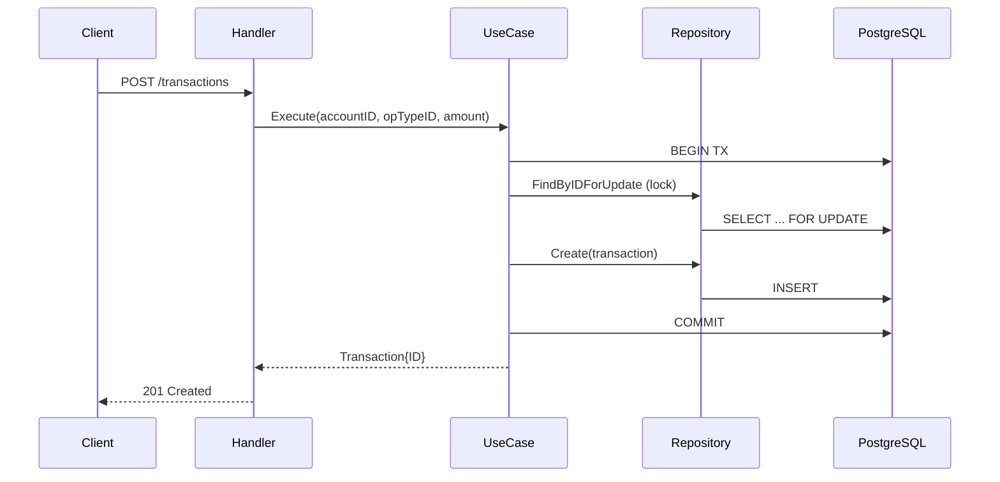

# Pismo Challenge

[English](#english) | [Português](#portugues)

---

<a name="english"></a>
## 🇺🇸 English

Financial accounts and transactions API. Built with Go  

### Quick Start

```bash
./scripts/start.sh
```

### Endpoints

| Method | Path | Description |
|--------|------|-------------|
| `POST` | `/accounts` | Create account |
| `GET` | `/accounts/{id}` | Get account |
| `POST` | `/transactions` | Create transaction ¹ |
| `GET` | `/healthz` | Health check |
| `GET` | `/metrics` | Prometheus metrics |

> ¹ Uses database transaction with row locking  

### Architecture





### Access URLs

| Service | URL | Credentials |
|---------|-----|-------------|
| **API** | http://localhost:8080 | - |
| **Grafana** | http://localhost:3000 | No login required |
| **Prometheus** | http://localhost:9090 | - |
| **pgAdmin** | http://localhost:5050 | `admin@pismo.com` / `admin` |

### pgAdmin → PostgreSQL

| Field | Value |
|-------|-------|
| Host | `postgres` |
| Port | `5432` |
| Database | `pismo` |
| User/Pass | `pismo` / `pismo` |

### Commands

| Command | Description |
|---------|-------------|
| `make start` | Start stack + show URLs |
| `make up` | Start Docker stack |
| `make down` | Stop Docker stack |
| `make test` | Run unit/integration tests |
| `make test-api` | Run API curl tests |

---

<a name="portugues"></a>
## 🇧🇷 Português

API de contas financeiras e transações. Construída com Go + Arquitetura Hexagonal.

### Início Rápido

```bash
./scripts/start.sh
```

### Endpoints

| Método | Path | Descrição |
|--------|------|-----------|
| `POST` | `/accounts` | Criar conta |
| `GET` | `/accounts/{id}` | Buscar conta |
| `POST` | `/transactions` | Criar transação ¹ |
| `GET` | `/healthz` | Health check |
| `GET` | `/metrics` | Métricas Prometheus |

> ¹ Usa transação de banco com lock de linha  

### URLs de Acesso

| Serviço | URL | Credenciais |
|---------|-----|-------------|
| **API** | http://localhost:8080 | - |
| **Grafana** | http://localhost:3000 | Sem login |
| **Prometheus** | http://localhost:9090 | - |
| **pgAdmin** | http://localhost:5050 | `admin@pismo.com` / `admin` |

### pgAdmin → PostgreSQL

| Campo | Valor |
|-------|-------|
| Host | `postgres` |
| Port | `5432` |
| Database | `pismo` |
| User/Pass | `pismo` / `pismo` |

### Comandos

| Comando | Descrição |
|---------|-----------|
| `make start` | Iniciar stack + mostrar URLs |
| `make up` | Iniciar Docker stack |
| `make down` | Parar Docker stack |
| `make test` | Rodar testes unit/integração |
| `make test-api` | Rodar testes curl da API |
